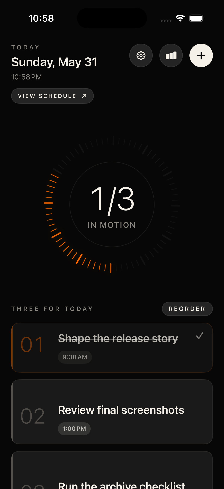
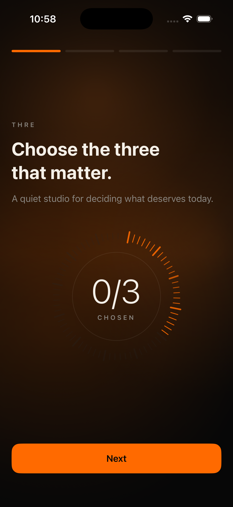
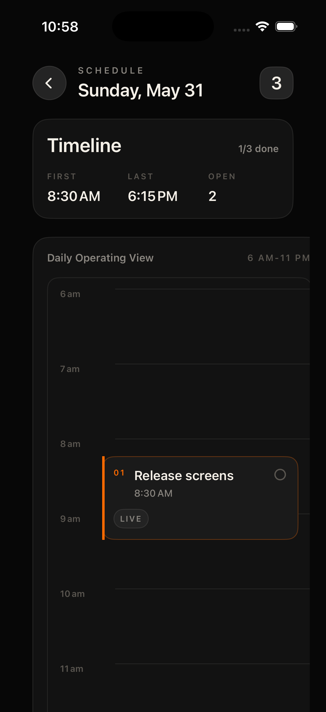
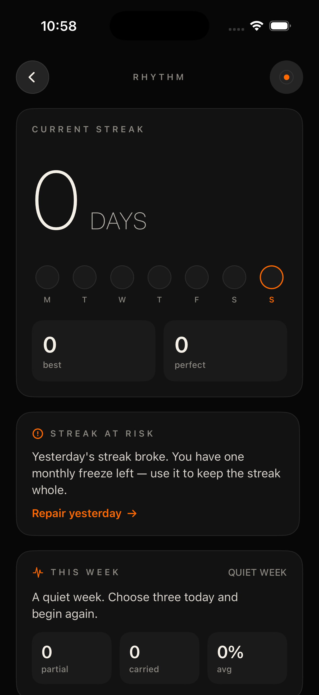
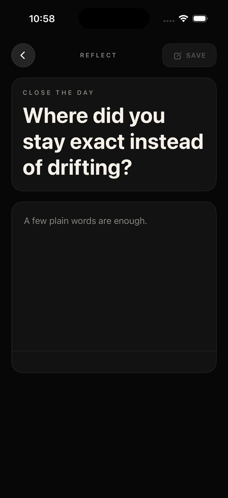
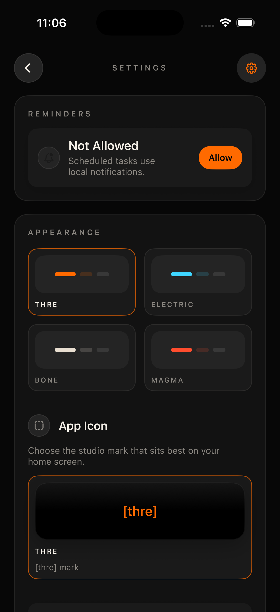

# thre

thre is a native iOS focus app built around one calm constraint: choose the three tasks that matter today, work through them deliberately, and close the day with rhythm and reflection.

The app is intentionally small in scope. It is not a general-purpose task manager, team workspace, or productivity dashboard. It is a SwiftUI reference project for building a focused, local-first iOS app with SwiftData, widgets, Live Activities, App Intents, reminders, share extension support, and a polished design system.



## Why This Matters

Most task apps reward accumulation. thre explores the opposite: a daily planning model where constraint is the feature. The project is useful for people who want a calmer focus workflow, and for iOS developers who want to study a complete SwiftUI app that goes beyond a single-screen sample.

The repository is maintained as an open-source app and learning resource. Good contributions include accessibility polish, test coverage, widget improvements, localization, documentation, and App Store readiness work that keeps the local-first privacy model intact.

## Features

- Three-task daily focus model with fixed slots.
- First-run onboarding with promise, slot explanation, rhythm payoff, and local personalization.
- Dark studio visual system with warm ember accent, tactile cards, animated orbit progress, and subtle route transitions.
- Add task, task detail, subtasks, schedule timeline, carry-forward, reflection, rhythm/streak, transcendence, and settings flows.
- SwiftData persistence with App Group storage fallback for widget access.
- Home Screen widgets, Lock Screen/StandBy widgets, and Live Activity focus sessions.
- Reminder scheduling, haptics, local preferences, app shortcuts/intents, share extension, and Spotlight indexing.
- UI-test launch routes for stable screenshots and visual QA.

## Screenshots

| Onboarding | Home | Schedule |
| --- | --- | --- |
|  |  |  |

| Rhythm | Reflection | Settings |
| --- | --- | --- |
|  |  |  |

More screenshots live in `ThreScreenshots/iPhone-17/`.

## Tech Stack

- SwiftUI
- SwiftData
- WidgetKit
- ActivityKit
- App Intents
- UserNotifications
- CoreSpotlight
- XCTest

## Requirements

- macOS with Xcode installed.
- iOS Simulator runtime compatible with the project deployment target.
- Xcode command line tools selected or `DEVELOPER_DIR` set explicitly.

Current project metadata:

- Display name: `thre`
- Xcode project/internal target family: `Ember`
- Bundle identifier: `com.ember.Ember`
- Marketing version: `1.0`
- Build number: `1`
- Deployment target: iOS `26.2`
- Main app device family: iPhone
- URL scheme: `ember://`
- App Group: `group.com.ember.focus`
- Privacy manifest: `Ember/PrivacyInfo.xcprivacy`

The internal `Ember` naming is an implementation codename retained to avoid a broad bundle/signing migration in this repository. The product name presented to users is `thre`.

## Build

Set `DEVELOPER_DIR` explicitly if your machine has `xcode-select` pointed at Command Line Tools instead of Xcode.

```sh
DEVELOPER_DIR=/Applications/Xcode.app/Contents/Developer xcodebuild -quiet -project Ember.xcodeproj -scheme Ember -destination 'generic/platform=iOS Simulator' -derivedDataPath /private/tmp/EmberDerivedData-OSS CODE_SIGNING_ALLOWED=NO build
```

Build for testing:

```sh
DEVELOPER_DIR=/Applications/Xcode.app/Contents/Developer xcodebuild -quiet build-for-testing -project Ember.xcodeproj -scheme Ember -destination 'generic/platform=iOS Simulator' -derivedDataPath /private/tmp/EmberDerivedData-OSS CODE_SIGNING_ALLOWED=NO
```

Focused unit tests, when the simulator launcher is stable:

```sh
DEVELOPER_DIR=/Applications/Xcode.app/Contents/Developer xcodebuild -quiet test -project Ember.xcodeproj -scheme Ember -destination 'platform=iOS Simulator,name=iPhone 17' -derivedDataPath /private/tmp/EmberDerivedData-OSS CODE_SIGNING_ALLOWED=NO -only-testing:EmberTests
```

Repository checks:

```sh
git diff --check
plutil -lint Ember/Info.plist EmberShareExtension/Info.plist EmberWidget/Info.plist Ember/PrivacyInfo.xcprivacy Ember/Ember.entitlements EmberWidgetExtension.entitlements
```

Full simulator test runs may fail before tests execute with `NSMachErrorDomain -308` from `IDELaunchiPhoneSimulatorLauncher`. Treat that as simulator launcher instability unless there is an app crash log or a failing assertion.

## Project Layout

- `Ember/` - main iOS app target.
- `Ember/DesignSystem/` - colors, spacing, typography, gradients, shadows, animation, and transition tokens.
- `Ember/Screens/` - feature screens and presentation flows.
- `Ember/Components/` - reusable SwiftUI building blocks.
- `Ember/Models/` - SwiftData models.
- `Ember/Services/` - persistence helpers, reminders, streaks, widgets/session support, logging, haptics, preferences, shortcuts, and indexing.
- `Ember/Navigation/` - route handling and deep links.
- `EmberWidget/` - widget and Live Activity extension code.
- `EmberShareExtension/` - share extension.
- `EmberTests/` and `EmberUITests/` - unit and UI test coverage.
- `ThreScreenshots/iPhone-17/` - screenshot set used for visual review and project documentation.
- `docs/` - architecture, roadmap, release notes, and program/application notes.

See [docs/architecture.md](docs/architecture.md) for a deeper walkthrough.

## UI-Test Launch Routes

Use simulator environment variables for stable screenshots and demo routes:

```sh
SIMCTL_CHILD_EMBER_UI_TESTING=1
SIMCTL_CHILD_EMBER_DISABLE_MORNING_RITUAL=1
SIMCTL_CHILD_EMBER_UI_TESTING_ROUTE=homeSeeded
```

Supported `EMBER_UI_TESTING_ROUTE` values:

- `homeSeeded`
- `morningRitual`
- `addTask`
- `taskDetail`
- `schedule`
- `streak`
- `reflection`
- `carryForward`
- `transcendence`
- `settings`

Optional onboarding page override:

```sh
SIMCTL_CHILD_EMBER_UI_TESTING_ONBOARDING_PAGE=account
```

Supported onboarding pages:

- `choose`
- `rhythm`
- `account`
- `daily`

Optional seeded titles:

```sh
SIMCTL_CHILD_EMBER_UI_TESTING_ADD_TASK_TITLE="Shape the launch slice"
SIMCTL_CHILD_EMBER_UI_TESTING_TASK_TITLE="Shape the launch slice"
```

## Privacy And Security

thre is local-first. The app does not include analytics, networking, crash-reporting SDKs, backend sync, or third-party auth.

`Ember/PrivacyInfo.xcprivacy` currently declares:

- No tracking.
- No collected data types.
- Accessed API reasons for UserDefaults, file timestamps, and system boot time.

Report security concerns through [SECURITY.md](SECURITY.md). Re-check the privacy manifest before adding analytics, networking, crash reporting, sync, backend auth, or any third-party SDK.

## Roadmap

See [docs/roadmap.md](docs/roadmap.md). Current high-value work:

- CI hardening across available Xcode versions.
- Accessibility and Dynamic Type audit.
- Localization prep.
- App Store readiness without changing the local-first data model.
- Widget and Live Activity reliability improvements.

## Contributing

Contributions are welcome. Start with [CONTRIBUTING.md](CONTRIBUTING.md), and look for issues labeled `good first issue` or `help wanted`.

## License

MIT. See [LICENSE](LICENSE).

## Maintainers

- Sheikh Hassan - creator, product direction, design direction, and maintainer.
- OpenAI Codex - AI development collaborator used during implementation, cleanup, documentation, and repository preparation.
